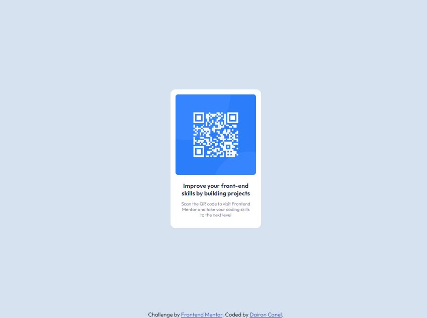

# Frontend Mentor - QR code component solution

This is a solution to the [QR code component challenge on Frontend Mentor](https://www.frontendmentor.io/challenges/qr-code-component-iux_sIO_H). Frontend Mentor challenges help you improve your coding skills by building realistic projects. 

## Table of contents

- [Overview](#overview)
  - [Screenshot](#screenshot)
  - [Links](#links)
- [My process](#my-process)
  - [Built with](#built-with)
- [Author](#author)

**Note: Delete this note and update the table of contents based on what sections you keep.**

## Overview

### Screenshot

### Links

- Solution URL: [https://www.frontendmentor.io/solutions](https://www.frontendmentor.io/solutions/qr-code-component-using-css-flexbox-s1r0Kjf1fv)
- Live Site URL: [https://frontendmentor-task3-daironcanel.netlify.app](https://frontendmentor-task3-daironcanel.netlify.app)

## My process

### Built with

- Semantic HTML5 markup
- CSS custom properties
- Flexbox

## Author

- Website - [Dairon Canel](https://portfolio-daironcanel.netlify.app)
- Frontend Mentor - [@RyuzakCoder](https://www.frontendmentor.io/profile/RyuzakCoder)

